# Housing market speculation

# Business Problem

In process...

# Objective and Solution Proposal

### Objective

Answer the House Rocket's CEO questions and create insights to discuss with the company business team and simulate business scenarios.

### Solution Proposal

Create a exploratory data analysis through all the dataset available and manipulate the data to answer the CEO questions and simulation business scenarios.

# Dataset Summary

- **`id`** [int]: Unique ID for each home sold
- **`date`** [date]: Date of the home sale
- **`price`** [float]: Price of each home sold
- **`bedrooms`** [categorical]: Number of bedrooms
- **`bathrooms`** [categorical]: Number of bathrooms. Where 1 accounts for a complete bathroom, 0.75 accounts a complete bathroom, but no bathtub and 0.5 accounts for a bathroom with a sink and toilet only
- **`sqft_living`** [float]: Square footage of the apartments interior living space
- **`sqft_lot`** [float]: Square footage of the land space
- **`floors`** [categorical]: Number of floors
- **`waterfront`** [binary]: A dummy variable for whether the apartment was overlooking the waterfront or not
- **`view`** [categorical]: An index from 0 to 4 of how good the view of the property was
- **`condition`** [categorical]: An index from 1 to 5 on the condition of the apartment
- **`grade`** [categorical]: An index from 1 to 13, where 1-3 falls short of building construction and design, 7 has an average level of construction and design, and 11-13 have a high quality level of construction and design
- **`sqft_above`** [float]: The square footage of the interior housing space that is above ground level
- **`sqft_basement`** [float]: The square footage of the interior housing space that is below ground level
- **`yr_built`** [int]: The year the house was initially built
- **`yr_renovated`** [int]: The year of the house’s last renovation
- **`zipcode`** [int]: What zipcode area the house is in
- **`lat`** [float]: Latitude
- **`long`** [float]: Longitude
- **`sqft_living15`** [float]: The square footage of interior housing living space for the nearest 15 neighbors
- **`sqft_lot15`** [float]: The square footage of the land lots of the nearest 15 neighbors 

#  Mind Map Hypoteses

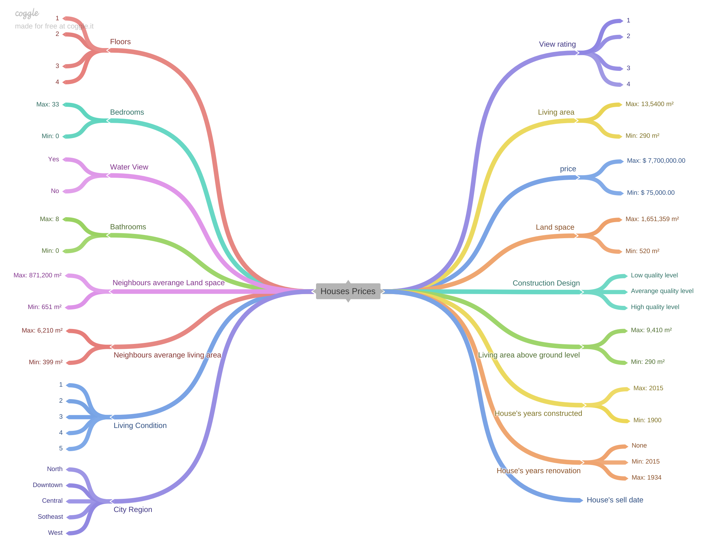 

## City's region split

By using the latitude and longitudes available in the dataset we could split the regions like this:

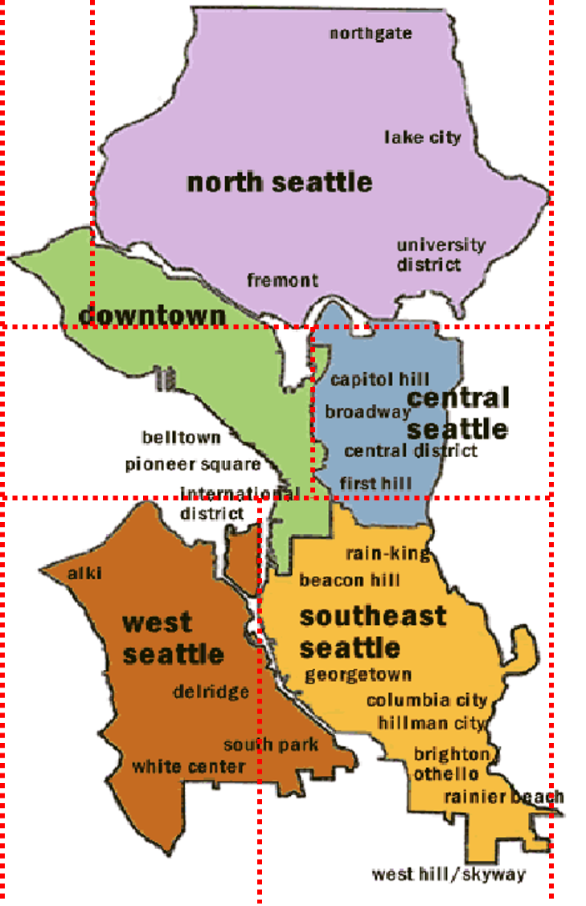 

# Exploratory Data Analysis

## Univariate Analysis

### Categorical Features Distribution Analysis

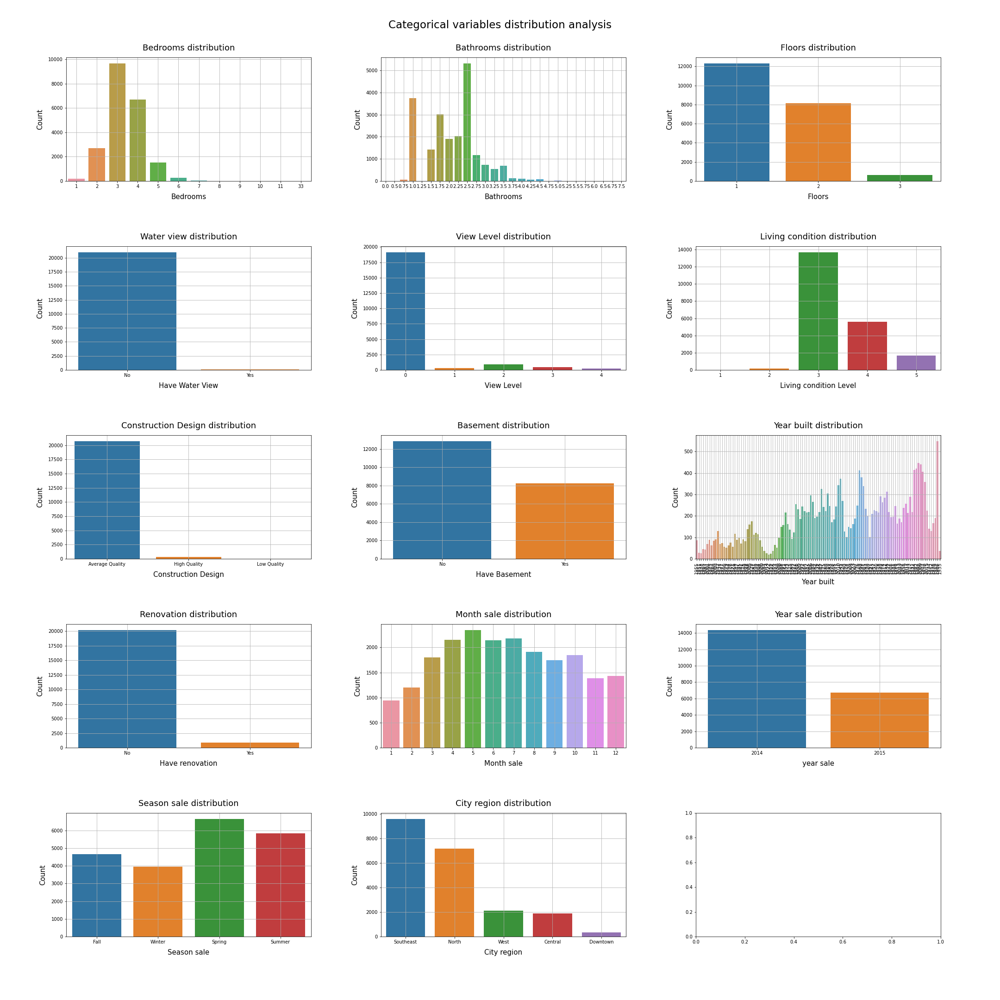 

- The bedrooms quantity is concentrated between 1 and 6. Which the most common is houses with 3 bedrooms, followed by 4 and 2 
- Talking about bathrooms, the most common is houses with 2.5 bathrooms, probably 2 bathrooms and a toilet (0.5)
- Talking about floors, the most common is houses with only 1 floor, followed by 2 and 3
- When it comes about water view, only a few percent of the houses have it
- When it comes about view level, almost all houses have a poor (0) view level
- When it comes about living condition, we can say that people in Seattle live quite good. With almost all houses having a level 3 or more living condition and only a few percent of the houses being a bad place to live in
- Talking about the construction design, almost all houses are labeled as having a average quality
- Talking about having a basement or not, its impressive that almost 40% of the houses have it
- When it comes about the house's year built, there is not a perceptive pattern, with some ups and downs between this period
- When it comes about if the house had a renovation, only a few did it
- Talking about the house's sales distribution between months, is clearly visible that between April and July is the period that sells more houses during the year
- When it comes about the house's sales distribution between years, even with only 2 years and a 12 months range, its impressive that from January-2015 until April-2015 there is almost the half of the houses sold compared to the hole 2014 year
- Talking about the house's sales distribution between the weather seasons, is clearly visible that the season that sells more houses is Spring, followed by summer
- When it comes about the house distribution between the city's region, more than a half of the houses as located in Southeast and North regions

### Numerical Features Distribution Analysis

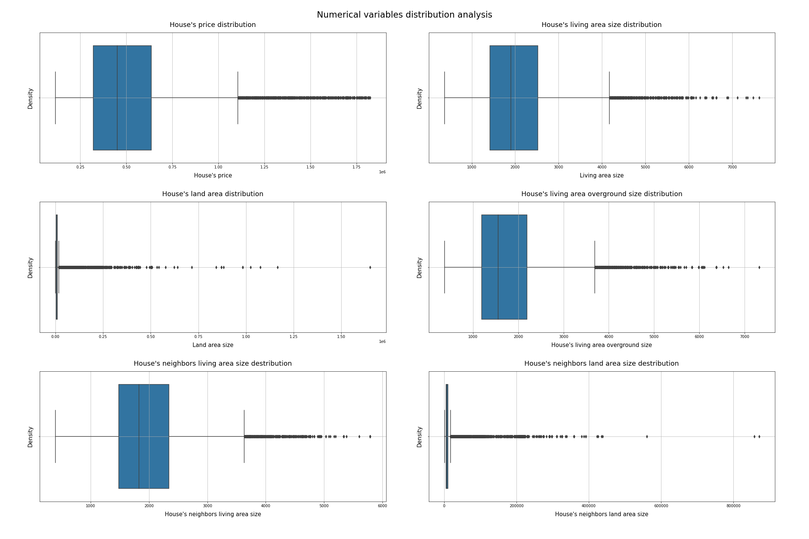 

- All numerical variables have significant high outliers
- **`land_area`** and **`neighbors_land_area`** have the most significant outliers amount

But, we won't go back to check these features outliers, because they won't affect our hypotheses analysis.

## Bivariate Analysis

### Hypothesis 1: For all city regions, their house's average price has a minimum increase of 10% by increasing the house's Living Condition

**FALSE**

 

- Southeast region don't have the average house's price minimum increase of 10% for each living condition levels upgrade. It can be seen when upgrading the living condition from level 3 to level 4, the house prices decreases. But, it has a significant 55,80% average houses price increase by upgrade the living condition level 2 to level 3.
- North region don't have the average house's price minimum increase of 10% for each living condition levels upgrade. Neither a significant average houses price increase when upgrading the living condition level.
- Even though west region has the average average house prices increase by upgrading the levels condition, when upgrading the living condition level 1 to level 2, its increases is only 1,95%. But, it has a significant 58,83% average houses price increase by upgrade the living condition level 2 to level 3.
- Central region don't have the average house's price minimum increase of 10% for each living condition levels upgrade. It can be seen when upgrading the living condition from level 1 to level 2, the house prices decreases. But, it has a significant 75,53% average houses price increase by upgrade the living condition level 2 to level 3.
- Downtown region have the average house's price minimum increase of 10% for each living condition levels upgrade. But, the houses prices increases when upgrading the living condition level are not significant, something like 11% for both levels. Also, it can be seen that the downtown region doesn't have living condition levels 1 and 2.

### Hypothesis 2: For all city regions, their house's average price has a minimum increase of 10% by increasing the house's Construction Design level

**TRUE**

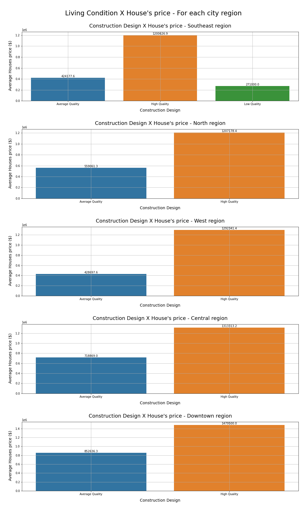 

- Southeast region do have the average house's price minimum increase of 10% for each construction design level upgrade. Also, it is the only region with low quality, when it comes about houses construction design. This because, proprably, its the poorest city's region.
- North region do have the average house's price minimum increase of 10% for each construction design level upgrade. It only has average and high quality levels. The average house's price difference when upgrading from level 2 to 3 is 115,92% raise
- West region do have the average house's price minimum increase of 10% for each construction design level upgrade. It only has average and high quality levels. The average house's price difference when upgrading from level 2 to 3 is 201,46% raise
- Central region do have average house's price the minimum increase of 10% for each construction design level upgrade. It only has average and high quality levels. The average house's price difference when upgrading from level 2 to 3 is 82,69% raise
- Downtown region do have average house's price the minimum increase of 10% for each construction design level upgrade. It only has average and high quality levels. The average house's price difference when upgrading from level 2 to 3 is 73,52% raise
- 
### Hypothesis 3: For North, downtown and west regions, their houses are more likely to be sold during the spring than any other season

**TRUE**

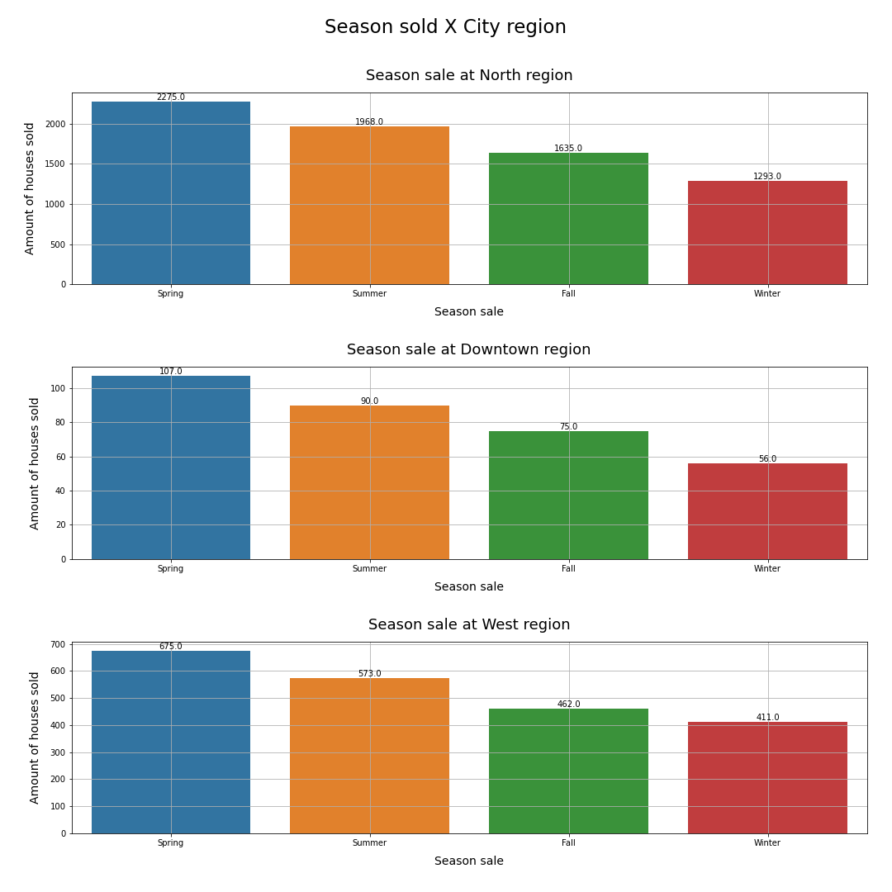 

All 3 regions have the approximately the same pattern when we talk about houses sale. Selling more houses during the spring, followed by summer, fall and winter.

### Hypothesis 4: For Central and Southeast regions, their houses are more likely to be sold during the winter than any other season

**FALSE**

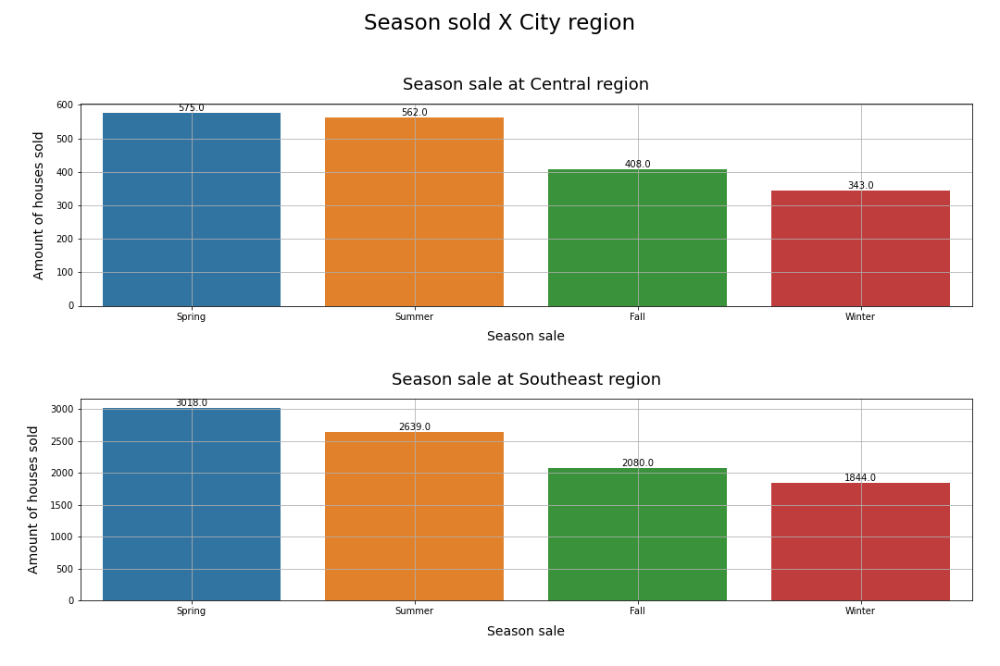 

Both regions have the approximately the same pattern when we talk about houses sale, which is almost the same of the other 3 regions. Selling more houses during the spring, followed by summer, fall and winter.

### Hypothesis 5: For all city regions, houses prices growth month over month is at a 3% minimum

**FALSE**

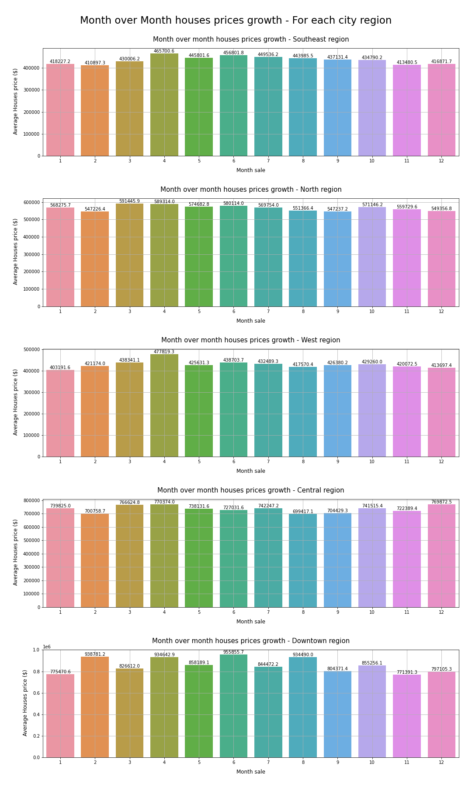 

- Southeast region don't have the average house's price minimum increase of 3% between each month. The house's price variates between the months, with ups and downs
- Southeast region don't have the average house's price minimum increase of 3% between each month. The house's price variates between the months, with ups and downs
- Southeast region don't have the average house's price minimum increase of 3% between each month. The house's price variates between the months, with ups and downs
- Southeast region don't have the average house's price minimum increase of 3% between each month. The house's price variates between the months, with ups and downs
- Southeast region don't have the average house's price minimum increase of 3% between each month. The house's price variates between the months, with ups and downs

But, when analysing all city regions, its clearly visible that, when talking about average house's prices sold and not the amount of houses sold, April is the month that sells the expensive houses

### Hypothesis 6: For all city regions, houses prices growth year over year is at a 10% minimum

**FALSE**

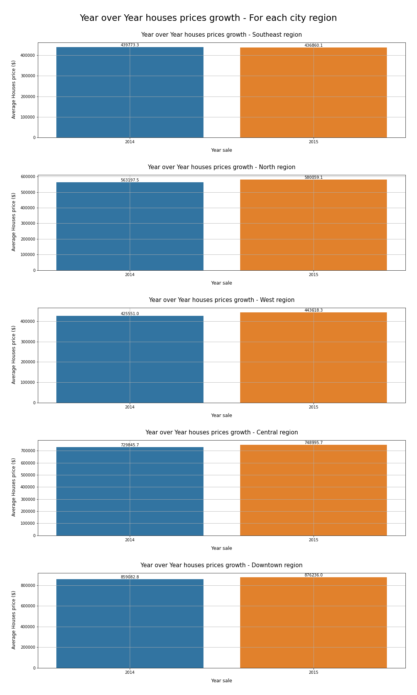 

- Southeast region don't have the average house's price minimium increase of 10% between the years. Also, the average houses price sold decreases between 2014 and 2015
- North region do presents an average house's price minium increase between the years. The increase was 2,99%, nothing close to 10%
- West region do presents an average house's price minium increase between the years. The increase was 4,24%, nothing close to 10%
- Central region do presents an average house's price minium increase between the years. The increase was 2,77%, nothing close to 10%
- Downtown region do presents an average house's price minium increase between the years. The increase was 2,00%, nothing close to 10%

### Hypothesis 7: For all city regions, their houses floor's number growth increases the house's price at a 20% minimum

**FALSE**

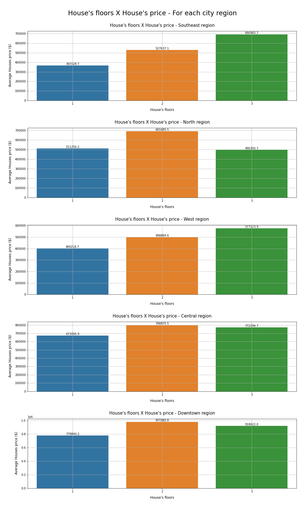 

- Southeast region do have the average house's price minimum increase of 20% when renovating its amount of floors. With a significant average house's price increase of 44,34% when upgrading from 1 to 2 floors
- North region don't have the average house's price minimum increase of 20% when renovating its amount of floors. Also, the average house's prices decreases when upgrading from 2 to 3 floors, probably because of other features influences
- West region do have the average house's price minimum increase of 20% when renovating its amount of floors. With a significant average house's price increase of 24,65% when upgrading from 1 to 2 floors
- Central region don't have the average house's price minimum increase of 20% when renovating its amount of floors. Also, the average house's prices decreases when upgrading from 2 to 3 floors, probably because of other features influences
- Downtown region don't have the average house's price minimum increase of 20% when renovating its amount of floors. Also, the average house's prices decreases when upgrading from 2 to 3 floors, probably because of other features influences. But, it has a significant average house's price increase of 25,32% when upgrading from 1 to 2 floors

### Hypothesis 8: For all city regions, the Living Area size growth is more likely to increase the house's prices

**TRUE**

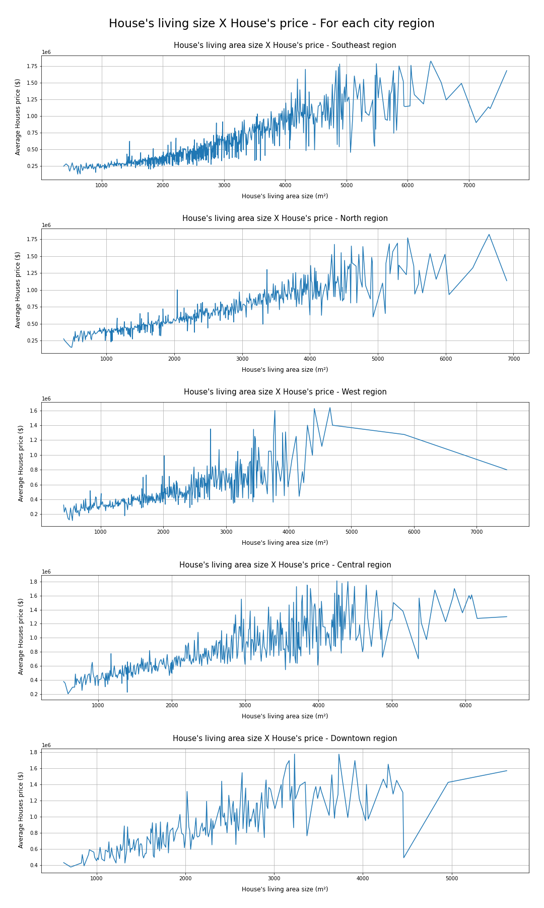 

For all city's regions, its clearly that not always a living area size increase will increase the average house's prices, because of other variables influences. But, analyzing with a macro view, its visible that the living area size increase will likely increase the house's price.

### Hypothesis 9: For all city regions, the (Living Area / Land Space) proportion growth is more likely to increase the house's prices

**FALSE**

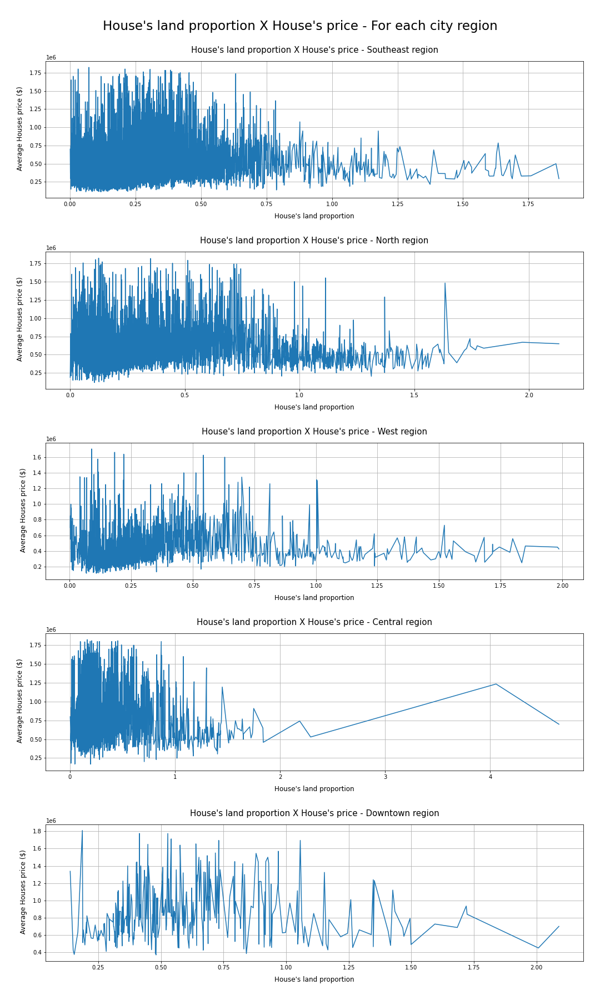 

For all city's regions, there is no visible pattern of house's prices increase or decrease when increasing the living area / land area proportion.

### Hypothesis 10: Houses with water view has a average price growth of 10% by increasing the house's Living Condition

**FALSE**

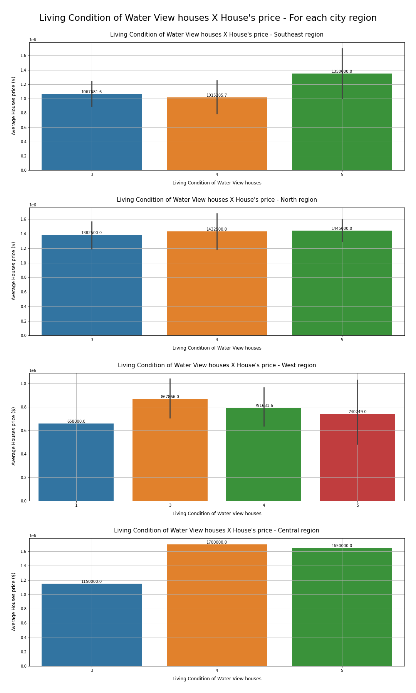 

- There is no houses with water view in Downtown region
- Southeast region don't have the average water view house's price minimum increase of 10% when upgrading the living condition levels. Also, there is no houses with living condition level less than 3 in Southeast region
- North region don't have the average water view house's price minimum increase of 10% when upgrading the living condition levels. The house's price tends to remain the same. Also, there is no houses with living condition level less than 3 in Southeast region
- West region don't have the average water view house's price minimum increase of 10% when upgrading the living condition levels. Also, there is a house's price decrease pattern after a living condition level 3
- Central region don't have the average water view house's price minimum increase of 10% when upgrading the living condition levels. But its important to notice that there is a significant average house's price increase of 47,82% when upgrading it from living condition level 3 to 4

### Hypothesis 11: For all city regions, by increasing the bedrooms quantity its most likely to increases the house prices

**TRUE**

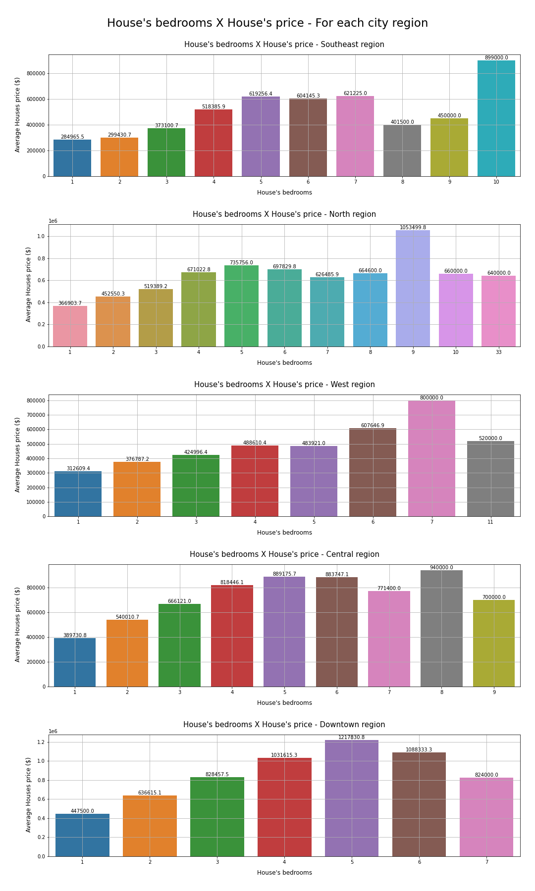 

For all city's regions, there is a pattern that by increasing the bedrooms quantity its most likely that the house's price will increase too.

- Southeast region respects this pattern in a range between 1 and 5 bedrooms
- North region respects this pattern in a range between 1 and 5 bedrooms
- West region respects this pattern in a range between 1 and 7 bedrooms
- Central region respects this pattern in a range between 1 and 5 bedrooms
- Downtown region respects this pattern in a range between 1 and 5 bedrooms

### Hypothesis 12: For all city regions, by increasing the bathrooms quantity its most likely to increases the house prices

**TRUE**

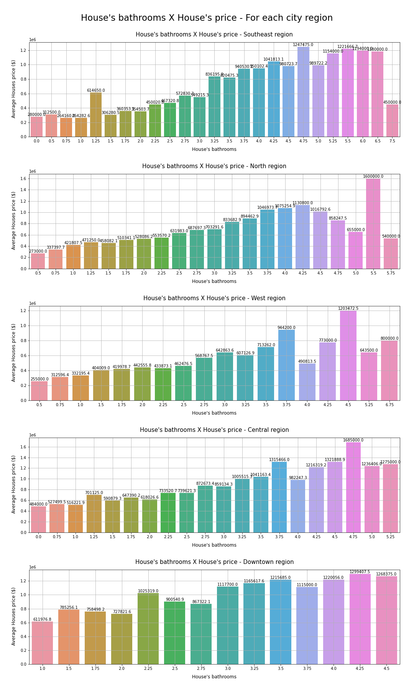 

For all city's regions, there is a pattern that by increasing the bathrooms quantity its most likely that the house's price will increase too.

## Multivariate Analysis

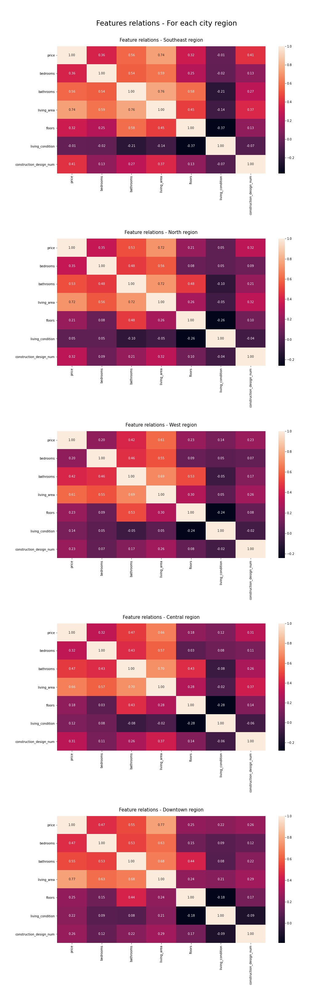 

**For Southeast region:**
- **`price`** feature has a strong positive correlation with the **`living_area`** feature
- **`price`** feature has a moderate positive correlation with the **`bedrooms`**, **`bathrooms`**, **`floors`** and **`construction_design_num`** features
- **`living_condition`** feature has a **weird** negative correlation with all others features
 

**For North region:**
- **`price`** feature has a strong positive correlation with the **`living_area`** feature
- **`price`** feature has a moderate positive correlation with the **`bedrooms`**, **`bathrooms`**, **`floors`** and **`construction_design_num`** features
- **`living_condition`** feature has a **weird** negative correlation with the **`bathrooms`**, **`living_area`** and **`floors`** features
- **`living_condition`** feature has a **weird** weak positive correlation with the **`bedrooms`** and **`price`** features
 

**For West region:**
- **`price`** feature has a strong positive correlation with the **`living_area`** feature
- **`price`** feature has a moderate positive correlation with the **`bedrooms`**, **`bathrooms`**, **`floors`**, **`living_condition`** and **`construction_design_num`** features
- **`living_condition`** feature has a **weird** negative correlation with the **`bathrooms`** and **`floors`** features
- **`living_condition`** feature has a **weird** weak positive correlation with the **`bedrooms`**, **`living_area`** and **`price`** features
 

**For Central region:**
- **`price`** feature has a strong positive correlation with the **`living_area`** feature
- **`price`** feature has a moderate positive correlation with the **`bedrooms`**, **`bathrooms`**, **`floors`**, **`living_condition`** and **`construction_design_num`** features
- **`living_condition`** feature has a **weird** negative correlation with the **`bathrooms`**, **`living_area`** and **`floors`** features
- **`living_condition`** feature has a **weird** weak positive correlation with the **`bedrooms`** and **`price`** features
 

**For Downtown region:**
- **`price`** feature has a strong positive correlation with the **`living_area`** feature
- **`price`** feature has a moderate positive correlation with the **`bedrooms`**, **`bathrooms`**, **`floors`**, **`living_condition`** and **`construction_design_num`** features
- **`living_condition`** feature has a **weird** negative correlation with the **`floors`** feature
- **`living_condition`** feature has a **weird** weak positive correlation with the **`bedrooms`** and **`floors`** features

# Answering the CEO's Questions

## Which houses should the company buy and at what price?

**Houses that the company should buy:**

1 - Our priority should be buying houses in Central region with a living condition level 2 and do a renovation so its living condition upgrades to level 3. This renovation will probably increase 75,53% the house's prices, as shown in H1. 

2 - As our second option would be buy houses in West region with a living condition level 2 and do a renovation so its living condition upgrades to level 3. This renovation will probably increase 58,83% the house's prices, as shown in H1. 

3 - As our third option would be buy houses in Southeast region with a living condition level 2 and do a renovation so its living condition upgrades to level 3. This renovation will probably increase 55,80% the house's prices, as shown in H1. 

- These renovations were considered having the same cost, i.e, it don't depends on the city's region
 

**Prices that the company should pay:**

If the company could calculate the renovations cost, and assuming that these renovations will cost less than the difference between the before and after renovation scenarios, the company should buy all houses mentioned previously, with prices on averange or lower.

If the company could not calculate the renovations cost, the company should buy all houses mentioned previously, but only with prices below averange. I suggest buy houses in those living conditions with prices 20% below average, so we secure our chances of profit

- These renovations should have a cost lower than the difference between before and after living condition scenarios, so the company profit with it

## Once the house is in the company's possession, what is the best time to sell it and what would be the sale price?

**Best time to sell the bought houses:**

As seen in H3 and H4, all city's regions has its sales peak during the spring, followed by summer. So these are the periods that I suggest to sell the houses.
 

**Suggested prices for houses sale:**

After do a renovation on the bought houses, I suggest simply sell them on their new living condition's averange price, for each  region. Because our profit will be originated by the upgrading the living condition, not from trying to sell over their supposed average prices.

## Should the company make a renovation to increase the price of the sale? What would be the suggestions for changes?

**About if the company should make a renovation:**

Yes, it should. All suggestions are based on renovations, as previously mentioned.
 

**Changing suggestions:**

- Even though the **`living_condition`** feature has sometimes a negative and sometimes a weak correlation with the features that it supposed to have a strong correlation, such as **`bedrooms`**, **`bathrooms`**, **`floors`** and **`living_area`**, as shown in section 4.3, I will assume that these features have strong correlation

- As shown in H8, by increasing the **`living_area`** the house's price will probably increases too. 
- As shown in H7, by increasing the **`floors`** quantity the house's price will increases too. 
 

So, I suggest that for houses with a small **`living_area`** / **`land_area`** proportion (lower than 1), the renovation focus should be into build more **`bedrooms`** and **`bathrooms`**, respecting the range accepted of **`bedrooms`** and **`bathrooms`** that increases the house's price, as shown in H11 and H12, respectively.

And for houses with a significant **`living_area`** / **`land_area`** proportion (higher than 1), the renovation focus should be into build a new floor, then build more **`bedrooms`** and **`bathrooms`**, respecting the range accepted of **`bedrooms`** and **`bathrooms`** that increases the house's price, as shown in H11 and H12, respectively.

# Business Simulation

Because of the lack of information, I will assume some premisses for each scenario simulation.

**OBS:** For more about the decisions made and how it was done: [House_Rocket notebook](https://github.com/pedrofratucci/House_Rocket/blob/main/notebooks/house_rocket_PH.ipynb)
    
## Expected Scenario

- For this scenario, I will assume that the renovation costs will be 30% of the bought house's price
- For this scenario, I will assume that we are going to buy the houses at their average price or lower, then sell them at their average prices, accordingly to their living condition level

**Expected profit: $ 16,916,830.39**
 
**Expected ROI: 0.59%**

## Worst Scenario

- For this scenario, I will assume that the renovation costs will be 30% of the bought house's price
- For this scenario, I will assume that we are going to buy the houses at their average price then sell them at 20% below their average prices, accordingly to their living condition level

**Expected profit: $ 7,841,484.51**
 
**Expected ROI: 0.28%**

## Best Scenario

- For this scenario, I will assume that the renovation costs will be 30% of the bought house's price
- For this scenario, I will assume that we are going to buy the houses at their average price then sell them at 20% above their average prices, accordingly to their living condition level

**Expected profit: $ 25,992,176.27**
 
**Expected ROI: 0.91%**

# Further Improvements

- Re-evaluate the outliers analysis, trying to find a better correlation between the **`living_condition`** feature with the others

- Collect more data related to renovations cost, so I can simulate more precise business scenarios

# References

## Business Problem Source
- https://youtu.be/DSVQ3HcxEPw?t=871

## Data Source
- https://www.kaggle.com/harlfoxem/housesalesprediction

## Supplementary Materials

- https://homes.cs.washington.edu/~domta/seattle-inequity.html
